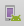

# First steps guide

The Map SDK is our vector maps library for Android. This guide will walk you through installing the SDK with [Android Studio](http://developer.android.com/sdk/index.html), loading a map, placing a marker on it, and changing the map style.

## Getting started

Here's what you'll need to get started:

- [__An access token__](https://www.mapbox.com/help/create-api-access-token/). You can find your access tokens on your [account page](https://www.mapbox.com/studio/account/tokens/).

- [__Android Studio__](http://developer.android.com/sdk/index.html). You can get this for free from Google.

- [__Google Play Developer Account__ (optional)](https://play.google.com/apps/publish/signup/). If you want to publish your app to Google Play, you'll need a Google Play developer account. Without one, you'll still be able to preview the app on an Android Virtual Device (AVD) or install the app on a physical device.

### Setting up Android Studio

Open Android Studio and go to `File ‣ New ‣ New Project` to create a new project (or select **Start a new Android Studio project**). Under **Configure your new project**:

- Name the project `My First Mapbox App`
- Set company domain to `mycompany.com`


Under **Select the form factors your app will run on**, check "Phone and Tablet." For minimum SDK, `select API 15: Android 4.0.3 (IceCreamSandwich)`. This is the lowest API level currently supported by Mapbox Android SDK.

Click **Next** to advance to the activity selection screen. Select **Empty Activity** and click **Next**. Accept the default `Activity Name` and `Layout Name` and click **Finish**.


### Set up an Android Virtual Device

Android Studio can help you set up virtual Android devices on your computer to help test your app while you develop. To set one up, click on the Android Virtual Device (AVD) Manager icon , then click the **Create Virtual Device** button. From the **Phones** category, select **Nexus 5X** and click **Next**. Select the release you would like to test against (this guide was built using Marshmallow API level 23, x86, Android 6.0). Learn more about setting up an AVD from [Android Studio's documentation](http://developer.android.com/tools/help/avd-manager.html).

## Installing Mapbox

We recommend installing with [Gradle](http://www.gradle.org/). This will automatically install the necessary dependencies and pull the Map SDK binaries from the Maven Central repository.

First, find your app's **Module Build File**, look for the "Gradle Scripts" section in the sidebar on the left hand side of Android Studio. Expand the section and double click on the "build.gradle (Module: app)" which is highlighted in blue in the screenshot below :


To install the current stable version, add the following to the `dependencies` of your **Module Build File** `~/MyFirstMapboxApp/app/build.gradle`:

```groovy
dependencies {
    // add the Mapbox SDK dependency below
    compile ('com.mapbox.mapboxsdk:mapbox-android-sdk:{mapSdkVersion}@aar'){
        transitive=true
    }
}
```
Above the `dependencies` section (`dependencies { ...`), add the following code:

```groovy
repositories {
    mavenCentral()
}
```


### App permissions

Add either a course or fine location permission in your project's `AndroidManifest.xml` file from `~/MyFirstMapboxApp/app/src/main/`:

```xml
<uses-permission android:name="android.permission.ACCESS_COARSE_LOCATION" />
<uses-permission android:name="android.permission.ACCESS_FINE_LOCATION" />
```

If the app is targeting Android Marshmallow (API 23) or later it's [necessary to request permissions at runtime](https://developer.android.com/training/permissions/requesting.html).

### Access tokens

To use Mapbox services and APIs, such as maps, directions, and geocoding, you must have a Mapbox access token. You can find your access tokens in [your account settings](https://www.mapbox.com/account/apps/), where you can retrieve current tokens and generate new ones. Using separate access tokens per project help you track usage and minimize disruption in the event a token needs to be revoked.

First, go to your account settings and create a new access token for `My First Mapbox App`. Once you've got your token, open `strings.xml` file from `~/MyFirstMapboxApp/app/src/main/res/values`.


Add a new string for your access token:

```xml
<resources>
    <string name="app_name">My First Mapbox App</string>
    <string name="access_token"><your access token here></string>
</resources>
```

Now open the `MainActivity.java` file and get a Mapbox instance in your `onCreate` method:

```java
@Override
protected void onCreate(Bundle savedInstanceState) {
  super.onCreate(savedInstanceState);
  // Line must go before the layout XML files loaded
  Mapbox.getInstance(this, getString(R.string.access_token));

  setContentView(R.layout.activity_main);
  ...
}
```

**Make sure that `Mapbox.getInstance(this, getString(R.string.access_token));` always runs before `setContentView`.** If not, your app will crash!


### MapView

The `MapView` behaves like any other `View` and its behavior can be changed statically with an [XML layout](http://developer.android.com/guide/topics/ui/declaring-layout.html) file, or programmatically during runtime.

To add the `MapView` as a layout element, replace the code in the `activity_main.xml` file from `~/MyFirstMapboxApp/app/src/main/res/layout/` with the following:

```xml
<?xml version="1.0" encoding="utf-8"?>
<RelativeLayout
  xmlns:android="http://schemas.android.com/apk/res/android"
  xmlns:tools="http://schemas.android.com/tools"
  xmlns:mapbox="http://schemas.android.com/apk/res-auto"
  android:layout_width="match_parent"
  android:layout_height="match_parent"
  tools:context=".MainActivity">

  <com.mapbox.mapboxsdk.maps.MapView
    android:id="@+id/mapview"
    android:layout_width="match_parent"
    android:layout_height="match_parent" />
</RelativeLayout>
```

Once you add the `MapView` to your layout, your layout preview should have a map which fills the device's screen _similar_ to:


Later on, you can call the `MapView` class programmatically within an Activity:

```java
findViewById(R.id.mapview);
```

### MapboxMap

Once you have declared and assigned your `MapView`, you will need to call `MapView.getMapAsync` to create a `MapboxMap` object. The `MapboxMap` object allows you to change styles and interact with your map.

```java
mapView.getMapAsync(new OnMapReadyCallback() {
  @Override
  public void onMapReady(MapboxMap mapboxMap) {

      // Interact with the map using mapboxMap here

  }
});
```

Now you're ready to start building with Mapbox!

## Adding a map

Let's add a map of Chicago to our app. To start, open your `My First Mapbox App` in Android Studio and navigate to `~/app/src/main/java/com.mycompany.myfirstmapboxapp/MainActivity.java`.


We're going to use the `mapView` class we set up earlier to add a Mapbox map to our app. The app needs to know *when* to add the map, so we'll do so when the activity is initialized with `onCreate`.

```java
private MapView mapView;

    @Override
    protected void onCreate(Bundle savedInstanceState) {
        super.onCreate(savedInstanceState);
        MapboxAccountManager.start(this, getString(R.string.access_token));
        setContentView(R.layout.activity_main);

        // Create a mapView
        mapView = (MapView) findViewById(R.id.mapview);
        mapView.onCreate(savedInstanceState);
    }
```

Next, use your new `mapView` object to create a `MapboxMap` object. `MapboxMap` has lots of built-in methods that will allow you to change map styles or camera position, add markers, and more. Create your `MapboxMap` inside an `OnMapReadyCallback`:

```java
private MapView mapView;

    @Override
    protected void onCreate(Bundle savedInstanceState) {
        super.onCreate(savedInstanceState);
        MapboxAccountManager.start(this, getString(R.string.access_token));
        setContentView(R.layout.activity_main);

        // Create a mapView
        mapView = (MapView) findViewById(R.id.mapview);
        mapView.onCreate(savedInstanceState);

        // Add a MapboxMap
        mapView.getMapAsync(new OnMapReadyCallback() {
            @Override
            public void onMapReady(MapboxMap mapboxMap) {

                // Customize map with markers, polylines, etc.

            }
        });
    }
```

### Configure your mapView

You can configure many of your map's characteristics, including starting camera position, and style URL, in your activity's layout file. Add the following to your activity's layout file, inside your `com.mapbox.mapboxsdk.maps.MapView` tags:

```xml
<com.mapbox.mapboxsdk.maps.MapView
    mapbox:mapbox_cameraTargetLat="41.885"
    mapbox:mapbox_cameraTargetLng="-87.679"
    mapbox:mapbox_styleUrl="@string/mapbox_style_mapbox_streets"
    mapbox:mapbox_cameraTilt="20"
    mapbox:mapbox_cameraZoom="12"
    ...
/>
```

[Click here](https://www.mapbox.com/android-docs/map-sdk/overview/#mapview-xml-attributes) to view all of the XML attributes that you can set for a `MapView`. Customize your map to your heart's content!

When you've finished entering the above code, you will probably see some red warning text from Android Studio. This is because we haven't yet imported some of the classes we're referencing in `MainActivity.java`. You can automatically import these classes by pressing <kbd class='txt-kbd'>Alt</kbd>+<kbd class='txt-kbd'>Enter</kbd> (<kbd class='txt-kbd'>Option</kbd>+<kbd class='txt-kbd'>Return</kbd> on Mac). Alternatively, manually add the following to the top of your `MainActivity.java` file, anywhere above the line that reads `public class MainActivity extends AppCompatActivity`:

```java
import android.app.Activity;
import android.os.Bundle;

import com.mapbox.mapboxsdk.maps.MapView;
import com.mapbox.mapboxsdk.maps.MapboxMap;
import com.mapbox.mapboxsdk.maps.OnMapReadyCallback;
import com.mapbox.mapboxsdk.MapboxAccountManager;
```

Next, we'll handle the other types of events that might affect our map app. This code is related to the map's behavior with [an Android app's activity lifecycle](https://developer.android.com/guide/components/activities/activity-lifecycle.html):

```java

@Override
public void onStart() {
    super.onStart();
    mapView.onStart();
}

@Override
public void onResume() {
    super.onResume();
    mapView.onResume();
}

@Override
public void onPause() {
    super.onPause();
    mapView.onPause();
}

@Override
protected void onStop() {
  super.onStop();
  mapView.onStop();
}

@Override
public void onSaveInstanceState(Bundle outState) {
    super.onSaveInstanceState(outState);
    mapView.onSaveInstanceState(outState);
}

@Override
public void onLowMemory() {
    super.onLowMemory();
    mapView.onLowMemory();
}

@Override
protected void onDestroy() {
    super.onDestroy();
    mapView.onDestroy();
}
```

Click the **Run 'app'** button  to build your app. Android Studio will take a few seconds to build and if it finishes without errors, you'll be able to test drive it in the AVD you set up earlier.


## Changing the map style

The Mapbox Android SDK comes bundled with a handful of map styles, so let’s try changing it up a bit. You can find a list of the current bundled styles with constants found in the Mapbox SDK's `Style` class.  Let’s use the `LIGHT` style (the version of Mapbox Light that conforms to the {{site.styleVersion}} release of the [GL style specification](https://www.mapbox.com/mapbox-gl-style-spec/)).

To set your map's initial style to `LIGHT`, open your `activity_main.xml` layout file and set `mapbox:mapbox_styleUrl` to
`@string/mapbox_style_light`:

```xml
<com.mapbox.mapboxsdk.maps.MapView
    mapbox:mapbox_styleUrl="@string/mapbox_style_light"
    ...
/>
```

You can also change your style programmatically using `MapboxMap` class' `setStyleURL();` method. Inside `onCreate()`, change the line that sets `mapboxMap`'s style to:

```java
mapboxMap.setStyleUrl(Style.LIGHT);
```


### Creating your own styles

You can create custom styles with [Mapbox Studio](https://www.mapbox.com/mapbox-studio/) and then add them to your app. To programmatically add one of your custom styles to your `mapboxMap`, head to your [styles page](https://www.mapbox.com/studio/styles/), copy your style's [style URL](https://www.mapbox.com/help/define-style-url/), and then add it to your `mapboxMap` object with `setStyleURL();`:

```java
mapboxMap.setStyleUrl("mapbox://styles/<your-account-name>/<your-style-ID>");
```

<!-- Change style properties in real time

Starting with version `4.2.0` you can tweak your map style on the fly at runtime. This includes adding new layers, styling layer properties like color and opacity, and much more. -->

<!-- TODO You can access many of the options using the `MapboxMap` object, checkout the [style examples](https://www.mapbox.com/android-sdk/examples/) to get started. -->

### Using Mapbox Studio Classic styles and maps

Raster maps and styles created with [Mapbox Studio Classic](https://www.mapbox.com/mapbox-studio-classic/) are not directly compatible with the Android SDK, though you can still load these maps [via a custom  style](https://www.mapbox.com/android-sdk/examples/custom-raster/). Please note that associated markers, lines, and shapes are not supported.

## Next steps

You just built a small Android app with Mapbox! You can now create an Android Studio project, install the Mapbox SDK, and change the map style. Pat yourself on the back!

As you continue to develop your Mapbox app, we recommend that you read the following:

* [Draw and configure markers](https://www.mapbox.com/help/android-markers/) &mdash; learn how to add and customize markers in your application
* [Attribution](https://www.mapbox.com/android-docs/map-sdk/overview/#attribution) &mdash; comply with the licensing terms of the map data used in your application

We'll be adding and updating guides to help you learn all of Mapbox's amazing features as we continue to develop it. Here are a few resources to keep you up-to-date with Mapbox:

* [Mapbox Android SDK documentation](https://www.mapbox.com/android-docs/map-sdk/overview)
* [Mapbox GL Native on GitHub](https://github.com/mapbox/mapbox-gl-native) to follow the open source project behind Mapbox Mobile

* [Download and explore our Android demo app](https://play.google.com/store/apps/details?id=com.mapbox.mapboxandroiddemo&hl=en) to see all of the simple, complex, and beautiful ways that you can use Mapbox in your Android project. 


